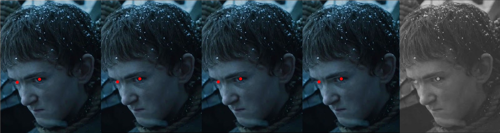

# react-chitemmu

React component to display the [Kitammuort](http://www.urbandictionary.com/define.php?term=Kitammuort) level using [Olly](http://gameofthrones.wikia.com/wiki/Olly) vengeful expression before behing hang.




## Installation

```bash
    $ npm install react-chitemmu --save
```


## Usage

```javascript
    import React from 'react'
    import Chitemmu from 'react-chitemmu'

    const App = (props) => {
        return <Chitemmu level={4} />
    }

    render(<App />, document.getElementById('app'))
```


## Test

```bash
    $ npm install
    $ npm test
```


## Credits

The Kitammuort level rating is an idea of the blogger and writer [DocManhattan](http://docmanhattan.blogspot.co.uk/) during his [reviews](http://docmanhattan.blogspot.co.uk/search/label/Game%20of%20Thrones) of the the episodes of Game of Thrones (in italian language only).
